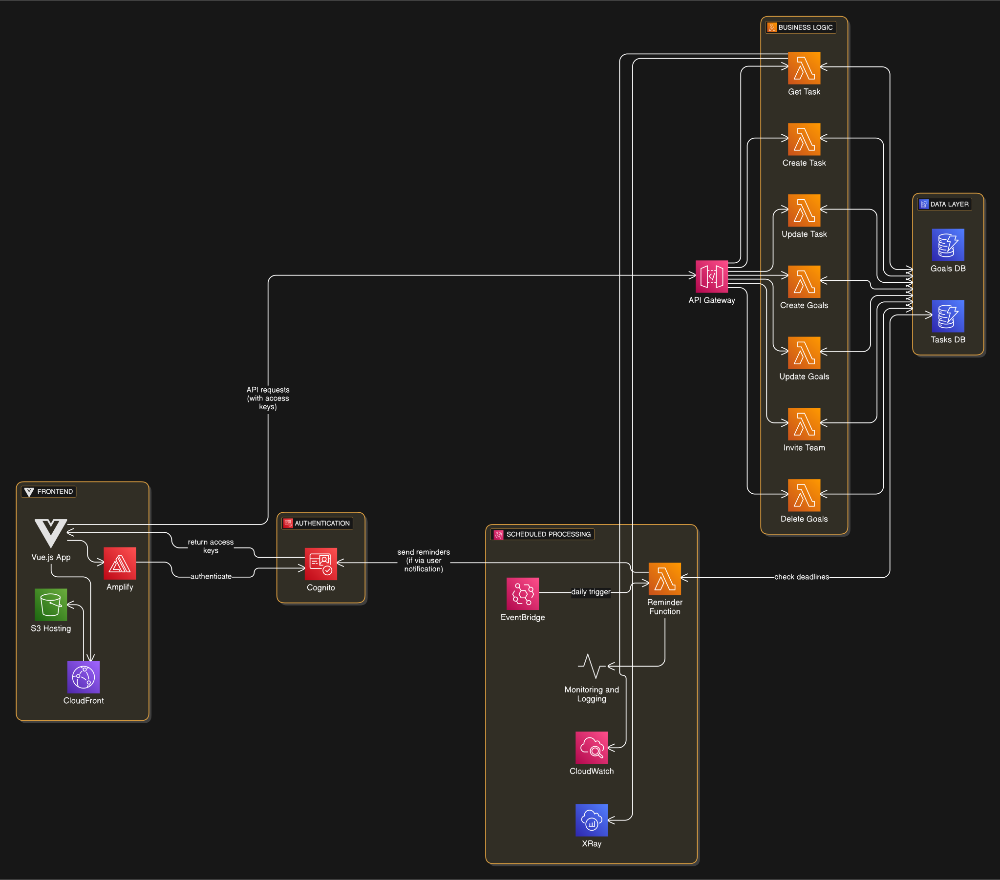
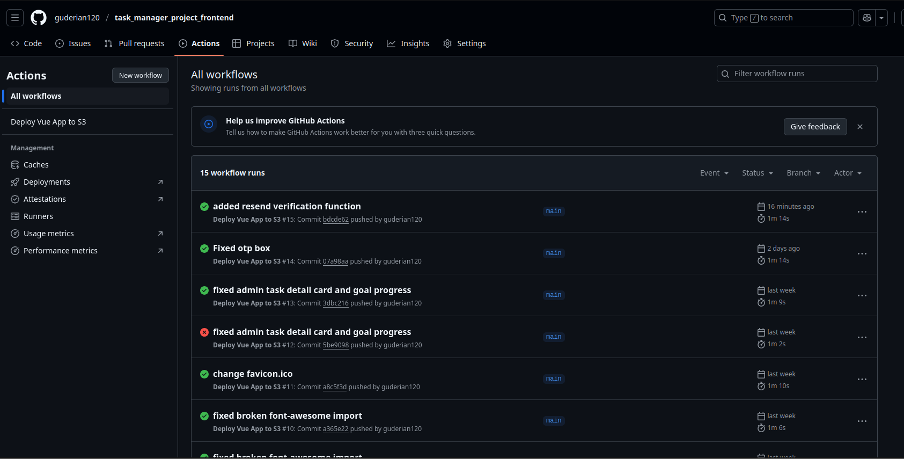
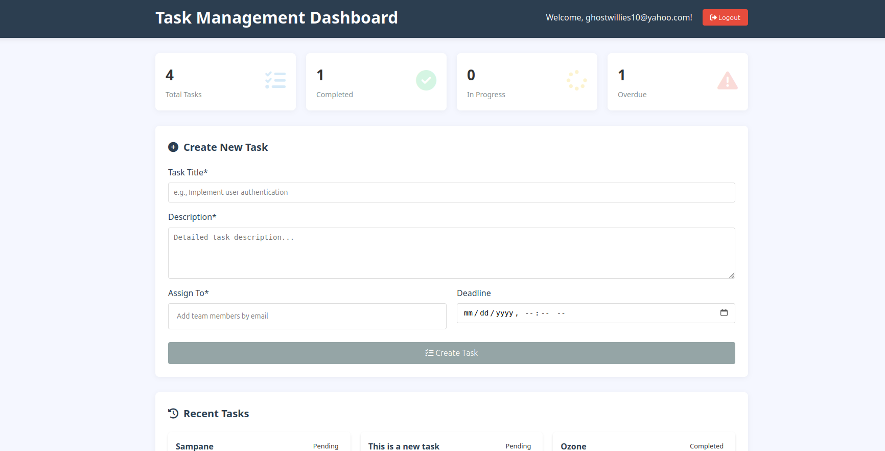
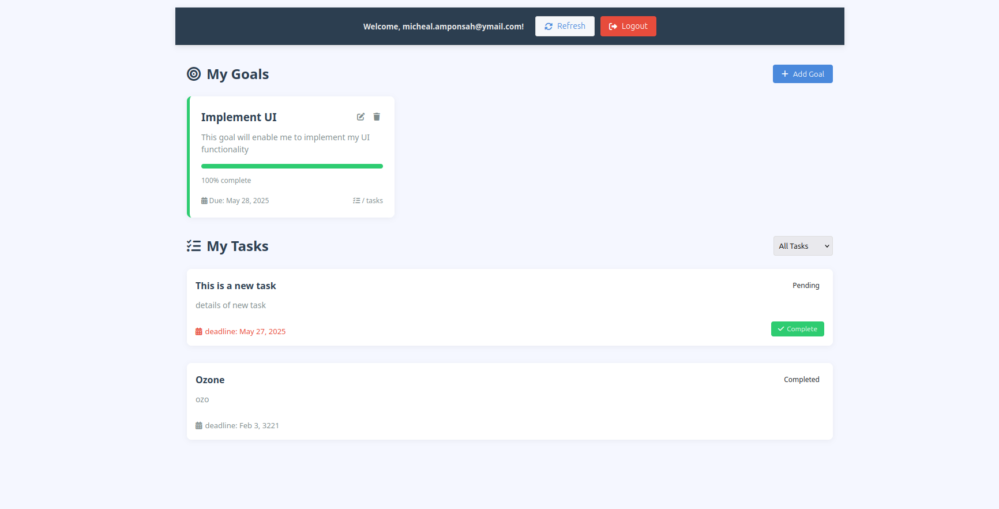
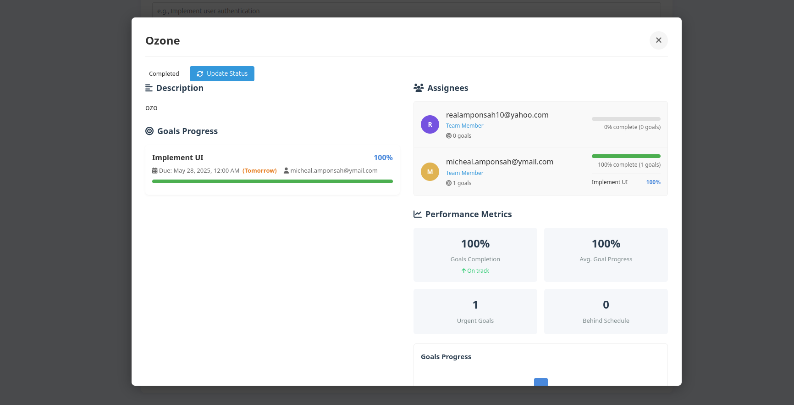
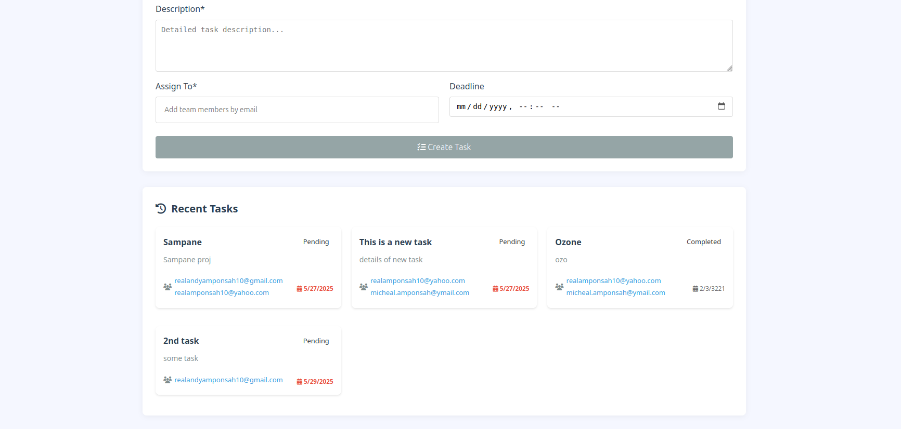
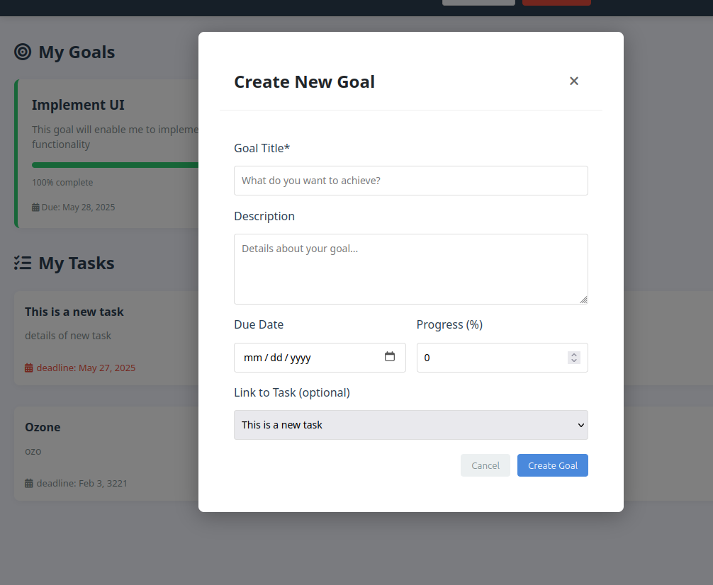

# Task Management System Documentation

## Project Overview
The Task Management System is a web application built with Vue.js, designed to streamline task allocation and progress tracking for teams. It supports two user roles: Admins and Team Members. Admins can create tasks and manage team members, while team members can view assigned tasks, set goals, and break down duties into trackable pieces. The application is hosted on an AWS S3 bucket, with AWS CloudFront for content delivery, AWS Lambda and DynamoDB for backend logic and storage, and AWS Cognito with Amplify for authentication. GitHub Actions automates deployment to S3 on code updates.

## 📚 Resources Table

| Stack            | Description                            | GitHub Link(s)                                                                        |
| --------------- | ---------------------------------- | ----------------------- | ------------------------------------------------------------------------------------- |
| **Backend**  | AWS Lambda handles business logic, interacting with Amazon DynamoDB for data storage. | [Django Workspace System](https://github.com/guderian120/workspace-system-management) |
| **Frontend** | Built with Vue.js, using AWS Amplify for authentication integration.  | This Repo                                                                                |
| **Live Application**  | Explore the live application here    | [Task Manager](https://dangf6yk5kpeq.cloudfront.net/)                           |


## System Architecture
The application uses a serverless architecture with the following components:
- **Frontend**: Built with Vue.js, using AWS Amplify for authentication integration.
- **Hosting**: Static assets are stored in an AWS S3 bucket configured for static website hosting.
- **Content Delivery**: AWS CloudFront serves as a CDN for global content delivery with low latency.
- **Backend**: AWS Lambda handles business logic, interacting with Amazon DynamoDB for data storage.
- **Authentication**: AWS Cognito manages user authentication, with AWS Amplify handling frontend auth flows.
- **CI/CD**: GitHub Actions automates building and deploying the Vue.js application to S3 on code pushes.



### Deployment Workflow
1. Code updates are pushed to the GitHub repository.
2. GitHub Actions triggers a workflow to:
   - Build the Vue.js application (`npm run build`).
   - Sync the `dist` folder to the S3 bucket.
3. AWS CloudFront serves the updated content, with cache invalidation triggered as needed.
4. Route 53 (optional) may map a custom domain to the CloudFront distribution.



## User Roles and Functionalities
### Admin
- **Create Tasks**: Admins can create tasks with details (title, description, due date, assignee) stored in DynamoDB. An invite is sent to assignees with logins to their portals
- **Manage Team Members**: Admins can add, remove, or update team members in Cognito and assign tasks.
- **View All Tasks**: Admins access a dashboard showing all tasks and their statuses.

### Team Member
- **View Assigned Tasks**: Team members see tasks assigned to them, retrieved from DynamoDB.
- **Set Goals**: Team members can create goals linked to tasks, stored as trackable items in DynamoDB.
- **Track Progress**: Goals can be updated or marked complete, with changes reflected in the database.


## Setup Instructions
### Prerequisites
- Node.js (v16 or later) and npm for local development.
- AWS CLI configured with credentials for S3, CloudFront, Lambda, DynamoDB, Cognito, and Amplify.
- AWS Amplify CLI installed (`npm install -g @aws-amplify/cli`). Ensure you are using version 5
- A GitHub repository with Actions enabled.
- AWS account with configured S3 bucket, CloudFront distribution, Lambda functions, DynamoDB tables, and Cognito user pool.

### Local Development
1. Clone the repository:
   ```bash
   git clone https://github.com/guderian120/task_manager_project_frontend/
   cd task-management-system
   ```
2. Install dependencies:
   ```bash
   npm install
   ```
3. Configure Amplify for authentication:
   ```bash
   amplify init
   amplify add auth  # Configure Cognito
   amplify push
   ```
4. Run the development server:
   ```bash
   npm run serve
   ```
5. Access the app at `http://localhost:8080`.

### Backend Setup
1. **DynamoDB**: Create tables for tasks, team members, and goals (e.g., `Tasks`, `Goals`) with appropriate partition and sort keys. Visit the resource table for backend docs
2. **Lambda**: Deploy functions for CRUD operations (e.g., `createTask`, `listTasks`, `setGoal`) with IAM roles for DynamoDB and Cognito access.
3. **API Gateway**: Expose Lambda functions via REST APIs, integrated with Cognito for authentication.
4. **Cognito**: Set up a user pool with admin and team member groups, and configure Amplify to use it.

### GitHub Actions CI/CD
The GitHub Actions workflow automates deployment to S3:
1. Create a `.github/workflows/deploy.yml` file:
   ```yaml
    name: Deploy Vue App to S3

    on:
      push:
        branches:
          - main
    jobs:
      deploy:
        runs-on: ubuntu-latest
        environment: Task_manager_project_frontend

        steps:
        - name: Checkout code
          uses: actions/checkout@v3

        - name: Set up Node.js
          uses: actions/setup-node@v3
          with:
            node-version: 18

        - name: Install dependencies
          run: npm install --legacy-peer-deps

        - name: Build Vue app
          run: npm run build

        - name: Deploy to S3
          uses: jakejarvis/s3-sync-action@master
          with:
            args: --delete
          env:
            AWS_S3_BUCKET:${{ secrets.BUCKET_NAME }} 
            AWS_ACCESS_KEY_ID: ${{ secrets.AWS_ACCESS_KEY_ID }}
            AWS_SECRET_ACCESS_KEY: ${{ secrets.AWS_SECRET_ACCESS_KEY }}
            AWS_REGION: ${{ secrets.AWS_REGION }}
            SOURCE_DIR: dist

   ```
2. Store AWS credentials in GitHub Secrets (`AWS_ACCESS_KEY_ID`, `AWS_SECRET_ACCESS_KEY`).
3. Push updates to the `main` branch to trigger deployment.

## User Interface Description
The UI is designed to be intuitive, with AWS Amplify handling authentication flows (e.g., login, signup). Below are key views with placeholders for your images.

### Admin Dashboard
- Displays all tasks and team members, fetched from DynamoDB via Lambda.
- Includes buttons for task creation and team member management.
- **Image Placeholder**: 


### Task Creation Form
- Form for admins to input task details, submitted to Lambda for storage in DynamoDB.
- **Image Placeholder**: 


### Team Member Task View
- Lists tasks assigned to the team member, with options to set goals.
- **Image Placeholder**: 


### Goal Setting Interface
- Allows team members to create and track goals, stored in DynamoDB.
- **Image Placeholder**: 


For further assistance, refer to AWS Amplify, Cognito, Lambda, DynamoDB, or Vue.js documentation, or contact the project maintainer.